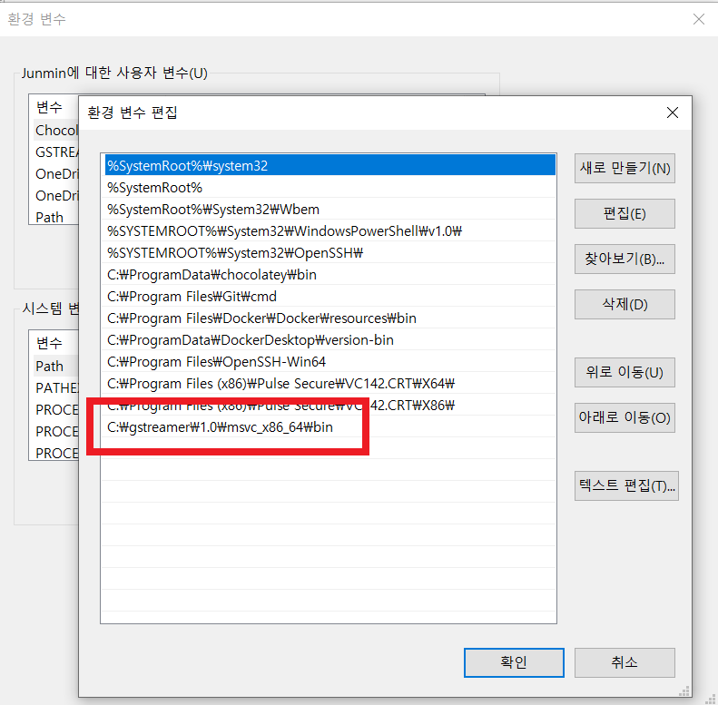
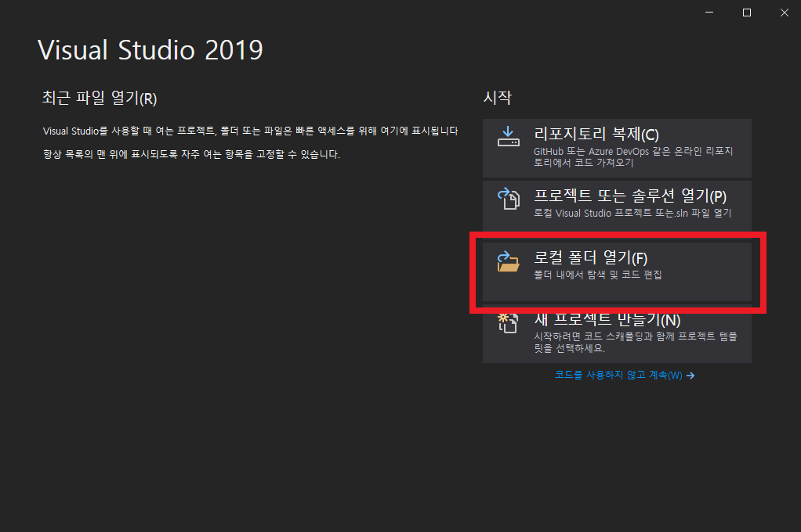

# Gstreamer-tutorial

본 저장소는 [GStreamer 공식 튜토리얼](https://gstreamer.freedesktop.org/documentation/tutorials/index.html?gi-language=c)의 내용을 토대로 개인적인 공부를 하는 곳입니다.

## How to set-up environment

빌드 환경은 CMake를 이용해 Linux와 Windows 모두 빌드할 수 있는 환경을 구축해두었습니다. Windows의 경우에는 Visual studio 2017 이상 버전을 사용하길 권장합니다.

### Linux

Ubuntu의 경우에는 `.devcontainer/Dockerfile`을 참고해서 디펜던시를 설치합니다.

### Windows
1. GStreamer 설치

GStreamer는 [GStreamer 다운로드 링크](https://gstreamer.freedesktop.org/data/pkg/windows/)에서 다운받을 수 있습니다.

Visual Studio 환경에서 빌드한다면 `https://gstreamer.freedesktop.org/data/pkg/windows/<version>/msvc` 폴더에 있는 파일들을 설치하시면 됩니다.
GSTreamer를 빌드하기 위해서는 `gstreamer-1.0-devel-msvc-<architecture>-<version>.msi`파일을 설치해야 하고, 실행을 위해서는 `gstreamer-1.0-msvc-<architecture>-<version>.msi` 설치가 필요합니다.

2. Path 환경 변수 추가

GStreamer 실행파일들을 Path 환경 변수에 추가해야 합니다.

* \<Gstreamer 설치 위치\>/bin

3. Visual studio CMake 프로젝트 열기

